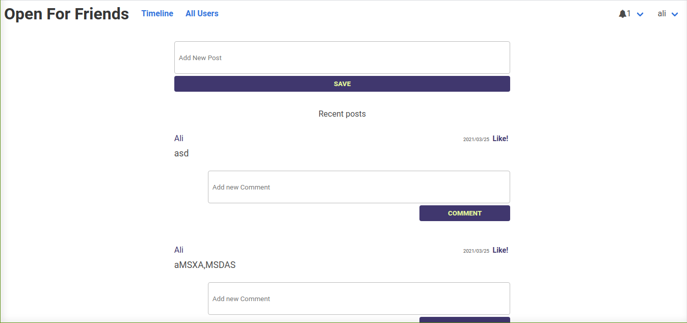

# Open for Friends

> Social media app Build with ruby on rails. In this app users are able to send friend request to other user and become friends of each other.

## Screen Shot



## Live Demo

[Demo](https://mysterious-tundra-66669.herokuapp.com/)

## Built With

- Ruby v3.0.0
- Ruby on Rails v6.1.3
- Rspec Rails v5.0
- Bulma Rails v0.9.1
- Capybara v3.26
- Devises v5.4.0
- shoulda-matchers v4.0
- font-awesome scss v5.15.1
- simple-form v5.1
- better_errors v2.9.1
- Rubocop v1.11
- Postgres

## Getting Started

To get a local copy up and running follow these simple example steps.

### Prerequisites

- Ruby: v3.0.0
- Rails: v6.1.3
- Postgres: v13.2
- Node v10.19.0 - v14.15.5
- Bundle v2.2.3

### Setup

Instal gems with:

```
bundle install
```

Setup database with:

```
   rails db:create
   rails db:migrate
```

### Usage

Start server with:

```
    rails server
```

Open `http://localhost:3000/` in your browser.

### Run tests

```
    rpsec --format documentation
```

### Deployment

TBA

## Authors

👨‍💻 **Jaim Delmar**

- Github: [@jadx2](https://github.com/jadx2/)
- Twitter: [@thecatcodes](https://twitter.com/thecatcodes)
- LinkedIn: [@Jaim Delmar](https://www.linkedin.com/in/jaimdelmar/)

👨‍💻 **Abdul Khaliq**

- Github: [@abdulkhaliqdev](https://github.com/abdulkhaliqdev)
- Twitter: [@abdulkhaliqdev](https://twitter.com/Abdulkhaliqdev)
- LinkedIn: [LinkedIn](https://www.linkedin.com/in/abdul-khaliq-89452b1a9/)

## 🤝 Contributing

Contributions, issues and feature requests are welcome!

Feel free to check the [issues page](https://github.com/jadx2/ror-social-scaffold/issues).

## Show your support

Give a ⭐️ if you like this project!

## Acknowledgments

- Microverse
